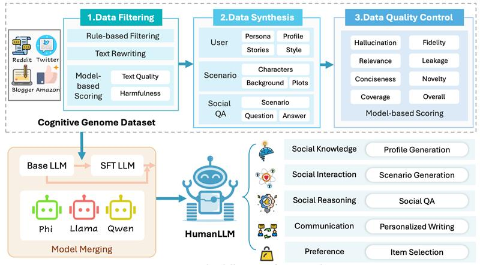

# HumanLLM
This is the official repository for our paper *"HumanLLM: Towards Personalized Understanding and Simulation of Human Nature"*

 [](https://arxiv.org/pdf/2601.15793)



---


## Usage Guide
### Dependencies
To set up the required environment, use the following command:
```bash
pip install -r requirements.txt
```
This will install all necessary Python modules and packages.

---

### Data Generation

HumanLLM provides a complete data generation pipeline that transforms raw user data into high-quality training samples for human-centric modeling.  
The pipeline consists of four stages:

🔍 **Data Filtering** → 🧬 **Data Synthesis** → ✅ **Quality Control** → ✍️ **SFT Data Generation**

These stages clean raw records, structure user behaviors, verify data quality, and finally convert the processed data into supervised fine-tuning (SFT) training samples.


#### 🚀 One-Command Pipeline

The entire pipeline can be executed with a single script:

```bash
bash dataset/scripts/data_gen.sh
```

⚠️ **Runtime Considerations**

The full pipeline is computationally intensive and may take a long time, especially during **data synthesis** and **quality control**.

For large-scale generation, we recommend:
- Running stages separately instead of the full pipeline at once  
- Using distributed execution 
---

### Model Training

Model training is implemented using [**LLaMA-Factory**](https://github.com/hiyouga/LLaMAFactory), an efficient framework for fine-tuning large language models.

Configuration files for different base models are provided in:
```bash
training/configs
```

To launch training, you can follow the example script:
```bash
training/scripts/train.sh
```
---

### Model Merging

Merge the SFT model with the corresponding base model to enhance the model’s generalization ability.:

```bash
bash training/scripts/lm_cocktail.sh
```

---

### Inference

Run automated inference pipeline for in-domain evaluation:

```bash
bash training/scripts/inference_pipeline.sh
```
---

### Citation

```
@article{lei2026humanllm,
  title={HumanLLM: Towards Personalized Understanding and Simulation of Human Nature},
  author={Lei, Yuxuan and Wang, Tianfu and Lian, Jianxun and Hu, Zhengyu and Lian, Defu and Xie, Xing},
  journal={arXiv preprint arXiv:2601.15793},
  year={2026}
}
```

---

### Contribution
We welcome contributions to HumanLLM! If you find issues or have suggestions for improvement, feel free to open an issue or submit a pull request. Thank you for using HumanLLM!