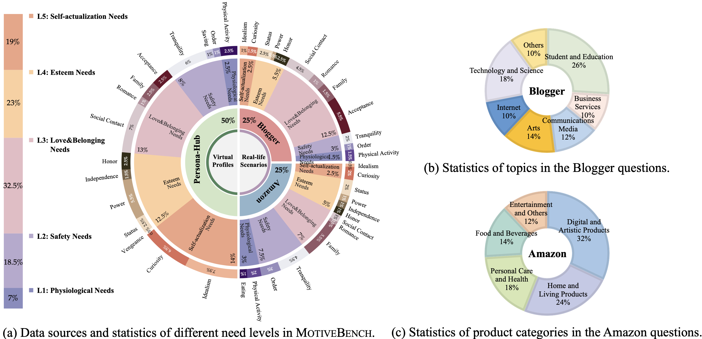

# MotiveBench
This is the official repository for our paper *"MotiveBench: How Far Are We From Human-Like Motivational Reasoning in Large Language Models?"*

 [](https://arxiv.org/abs/2506.13065) [](https://huggingface.co/datasets/chicosirius/MotiveBench) 


---

## Overview
MotiveBench provides a comprehensive evaluation framework for analyzing how well large language models (LLMs) emulate human-like motivational reasoning. The framework includes datasets, evaluation pipelines, and tools to interface with both open-source and closed-source models. By supporting a wide range of LLMs, MotiveBench enables systematic comparisons and insights into their reasoning capabilities.



---

## Usage Guide

### Dependencies
To set up the required environment, use the following command:
```bash
pip install -r requirements.txt
```
This will install all necessary Python modules and packages.

---

### Evaluation Pipeline
The evaluation process in MotiveBench requires you to establish an LLM call port before testing models. This setup ensures seamless communication between the evaluation client and the model server, regardless of whether the model is open-source or closed-source. Here's a step-by-step guide:

#### Step 1: Establish an LLM Call Port
LLMs can be accessed via different mechanisms depending on their type:
- **Open-source models**: Pulled from Hugging Face and served using the `vllm` reasoning framework.
- **Closed-source models**: Accessed via API calls, such as through Azure OpenAI.

For example:

- To serve the open-source model `Qwen/Qwen2.5-7B-Instruct` on port 3000:
  ```bash
  python server_vllm.py \
      --model='Qwen/Qwen2.5-7B-Instruct' \
      --port=3000
  ```

- To serve the closed-source model `GPT-4o-mini` on port 4000:
  ```bash
  python server_openai.py \
      --model='GPT-4o-mini' \
      --port=4000
  ```

**Why establish an LLM call port?**
This approach decouples the evaluation framework from model serving, enabling flexible testing across diverse models and testsets. Open-source models leverage local computation, while closed-source models rely on cloud-based APIs, each requiring distinct configurations.

#### Step 2: Run the Evaluation
Once the call port is established, you can run tests on your selected datasets. The evaluation script supports both Chain-of-Thought (CoT) reasoning and direct answers.

For example:

- To test `Qwen/Qwen2.5-7B-Instruct` on the "Amazon" dataset with CoT reasoning enabled:
  ```bash
  python client_eval.py \
      --dataset='Amazon' \
      --llm='Qwen/Qwen2.5-7B-Instruct' \
      --port=3000 \
      --cot
  ```

- To test `GPT-4o-mini` on the "Amazon" dataset without CoT reasoning:
  ```bash
  python client_eval.py \
      --dataset='Amazon' \
      --llm='GPT-4o-mini' \
      --port=4000
  ```

The following parameters can be configured for the evaluation:

- `--dataset`: Specifies the dataset to use for evaluation. Choices include `Persona`, `Amazon`, and `Yelp`.
- `--llm`: Specifies the LLM model to evaluate. **This should match the model served at the specified port.**
- `--port`: Specifies the port on which the server should run. Default: `4000`.
- `--cot`: Enables Chain-of-Thought reasoning mode, allowing the model to reason step-by-step.
- `--parse_mode`: Enables parsing of option letters in the model’s output, useful for models with limited instruction-following capability.

#### Step 3: View Results
The evaluation script generates detailed results, including:
- **Answers**: Model outputs for each test question.
- **Metrics**: Accuracy of three different tasks.

Results are saved in the `results/` directory by default. Check the corresponding subfolder for each model and dataset combination.

---

### Datasets
MotiveBench includes a variety of datasets to evaluate motivational reasoning capabilities across different domains. Available datasets include:

1. **Amazon**: Questions based on online customer reviews and purchase decisions from https://amazon-reviews-2023.github.io/.
2. **Blog**: Scenarios related to blog posts from https://www.kaggle.com/datasets/rtatman/blog-authorship-corpus.
3. **Persona**: Questions generated by diverse profiles from https://huggingface.co/datasets/proj-persona/PersonaHub.

You can specify the dataset during evaluation using the `--dataset` flag. For example, `--dataset='Amazon'` tests the model on the Amazon dataset.

---

### Supported Models
MotiveBench supports a wide range of open-source and closed-source models, including:

1. **Baichuan Models**:
   - `baichuan-inc/Baichuan2-7B-Chat`
   - `baichuan-inc/Baichuan2-13B-Chat`

2. **ChatGLM Models**:
   - `THUDM/chatglm3-6b`
   - `THUDM/glm-4-9b-chat`

3. **Yi Models**:
   - `01-ai/Yi-1.5-6B-Chat`
   - `01-ai/Yi-1.5-9B-Chat`
   - `01-ai/Yi-1.5-34B-Chat`

4. **Phi Models**:
   - `microsoft/Phi-3-mini-4k-instruct`
   - `microsoft/Phi-3-small-8k-instruct`
   - `microsoft/Phi-3-medium-4k-instruct`
   - `microsoft/Phi-3.5-mini-instruct`

5. **Llama Models**:
   - `meta-llama/Llama-2-7b-chat-hf`
   - `meta-llama/Llama-2-13b-chat-hf`
   - `meta-llama/Llama-2-70b-chat-hf`
   - `meta-llama/Llama-3.1-8B-Instruct`
   - `meta-llama/Llama-3.1-70B-Instruct`

6. **Qwen Models**:
   - `Qwen/Qwen-7B-Chat`
   - `Qwen/Qwen-14B-Chat`
   - `Qwen/Qwen-72B-Chat`
   - `Qwen/Qwen2-7B-Instruct`
   - `Qwen/Qwen2-72B-Instruct`
   - `Qwen/Qwen2.5-7B-Instruct`
   - `Qwen/Qwen2.5-14B-Instruct`
   - `Qwen/Qwen2.5-32B-Instruct`
   - `Qwen/Qwen2.5-72B-Instruct`

7. **GPT Models**:
   - `GPT-35-Turbo`
   - `GPT-4o-mini`
   - `GPT-4o`

---

### Citation

```
@misc{yong2025motivebench,
      title={MotiveBench: How Far Are We From Human-Like Motivational Reasoning in Large Language Models?}, 
      author={Xixian Yong and Jianxun Lian and Xiaoyuan Yi and Xiao Zhou and Xing Xie},
      year={2025},
      eprint={2506.13065},
      archivePrefix={arXiv},
      primaryClass={cs.CL},
      url={https://arxiv.org/abs/2506.13065}, 
}
```

---

### Contribution
We welcome contributions to MotiveBench! If you find issues or have suggestions for improvement, feel free to open an issue or submit a pull request. Thank you for using MotiveBench!
