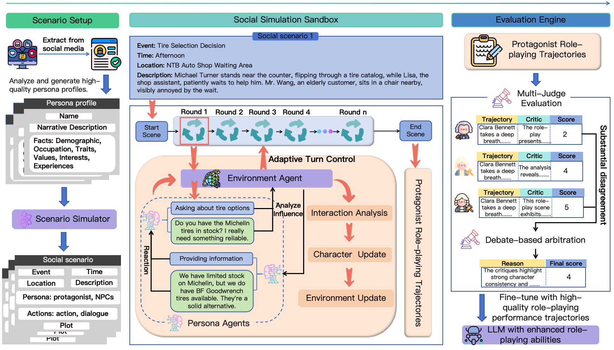

# PersonaArena

PersonaArena is a "role-playing + evaluation" workflow: it first runs interactions (simulation) under a given persona, then uses an evaluation model to score the results and outputs easy-to-understand tabular metrics.

<p align="center">



</p>

## What This Repository Does

- **Generate interaction records (simulation)**: The narrator constructs scenarios, the protagonist (LLM under test) and NPCs interact according to their respective personas, and the system records complete actions and dialogues.

- **Automatic evaluation**: Scores the protagonist's performance in each scenario across 8 dimensions, generating detailed CSV files and summary CSV files.

- **Model comparison**: Switch models and APIs in `config/play.yaml` to reproduce or compare results.

## Installation

```shell

pip install -r requirements.txt

```

## Quick Start (Single Simulation)

1. Fill in model and API information in the configuration file (for example: `config/play.yaml`).

- `character_llm` / `narrator_llm` / `npc_llm`: model name or alias (including locally deployed model names).

- `*_api_key` / `*_api_base`: API credentials for each model.

- Detailed parameter descriptions are available in the comments of `config/play.yaml`.

- Supports any OpenAI-compatible endpoint (including self-hosted services).

2. Run a single simulation:

```shell

python -u simulator.py --config_file config/play.yaml --log_file simulation.log

```
3. Outputs:

- Interaction records: `output/record/<title>/...`

- Logs: `output/log/simulation/<title>/...`

- Auto-generated scenarios (if auto-generation is enabled): `output/scenes/` or `generated_scenes/`

> "Simulation" means: automatically generating scenarios based on persona + running complete interactions (actions + dialogue) + recording all content.

## Batch Simulation (Multiple Personas/Models)

Script: `scripts/run_persona_batch.sh`

**Note**: This script hardcodes persona indices and configuration lists (`INDICES`, `CONFIGS`). Please edit the script and prepare related configuration files before running.

```shell

chmod +x scripts/run_persona_batch.sh

scripts/run_persona_batch.sh

```

Common edits:

- `PERSONA_FILE`: persona jsonl path (default: `persona_data/1000_persona.en.jsonl`)

- `INDICES`: persona indices to run

- `CONFIGS`: list of model configurations to run

If a proxy is needed on first run (to download HuggingFace embedding models):

```shell

export http_proxy=xxx; export https_proxy=xxx

```

## Evaluation

After simulation is complete, run the evaluation script to output metrics.

Script: `scripts/run_evaluation.sh`

- Detailed parameter descriptions are available in the comments of `config/evaluation.yaml`.

**Note**: `TITLE` / `NARRATOR_LLM` / `CHARACTER_LLM` must be set, and they must match the record filenames.

```shell

chmod +x scripts/run_evaluation.sh

scripts/run_evaluation.sh

```

Outputs:

- Details: `output/evaluation/detail/<title>/<character>_<narrator>_character_evaluation_detail.csv`

- Summary: `output/evaluation/multi/<title>/<narrator>_<scene_id>_character_evaluation_avg.csv`

Metrics (8 dimensions):

1. Knowledge accuracy

2. Emotional expression

3. Personality traits

4. Behavioral accuracy

5. Immersion

6. Adaptability

7. Behavioral consistency

8. Interaction richness

### Results Table (see the final CSV file) （`output/evaluation/multi/<title>/<narrator>_<scene_id>_character_evaluation_avg.csv`）

```table
| Title | Evaluator | Narrator | Model | Scene ID | Rounds | Knowledge Accuracy | Emotional Expression | Personality Traits | Behavioral Accuracy | Immersion | Adaptability | Behavioral Consistency | Interaction Richness | Average | Debate Count |

| ... | ... | ... | ... | ... | ... | ... | ... | ... | ... | ... | ... | ... | ... | ... | ... |

```
