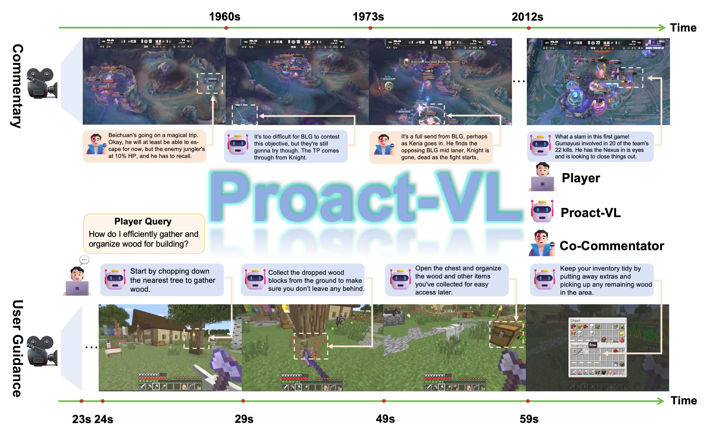
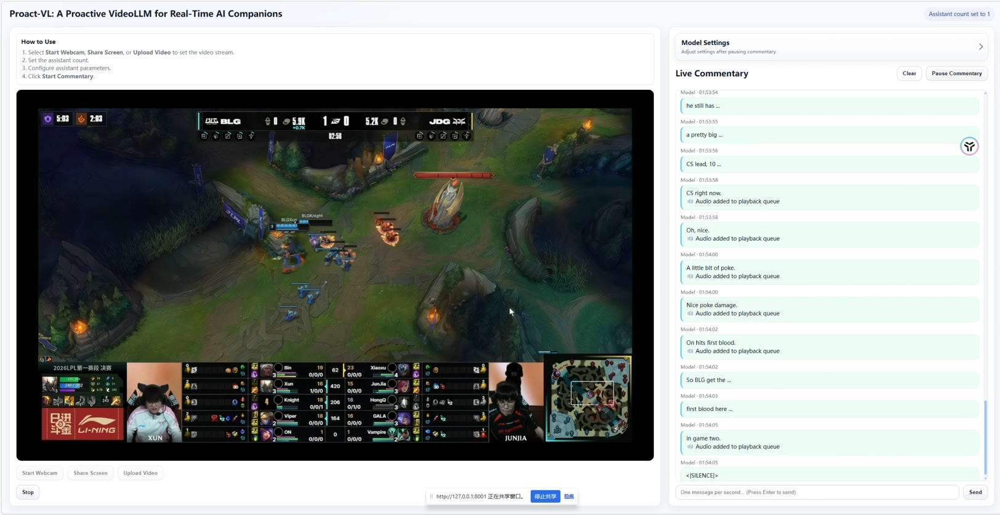

# Proact-VL: A Proactive VideoLLM for Real-Time AI Companions

<a href="https://proact-vl.github.io" target="_blank"></a>
<a href="https://arxiv.org/abs/2603.03447" target="_blank"></a>
<!-- <a href="" target="_blank"></a>
<a href="" target="_blank"></a> -->


## TLDR
We provide Proact-VL,  a general framework that shapes multimodal language models into proactive, real-time interactive agents capable of human-like environment perception
and interaction.


## Key Features

- 🎮 **Real-Time Processing**: Handles infinite video streams with low latency
- 💬 **Multi-Modal Commentary**: Supports single-speaker, multi-speaker, and guidance commentary scenarios
- 🚀 **Proactive Understanding**: Goes beyond reactive responses to provide contextual insights
- 🔧 **Flexible Architecture**: Built on multiple backbone models (Qwen2-VL, Qwen2.5-VL, Qwen3-VL)
- 📊 **Comprehensive Evaluation**: Includes gaming scenario evaluation with LLM-based judging

## 📢 News
- **[2026.03.16]** 🎉 Proact-VL code released!

## TODO List
- [ ] Release the model zoo (pretrained checkpoints).
- [ ] Release the training dataset and training scripts.
- [ ] Release the test dataset and evaluation scripts.


## Installation
### Conda Environment Setup
Environment for basic usage.
```
sh script/env/prepare_env.sh
```

## Quick Start
1) Solo commentary, co-commentary, and user guidance scenarios

We provide a quick inference script in `quickstart.py` which support SOLO commentary, co-commentary and user guidance scenario.


2) multi-assistant commentary

Another interesting application is to initialize multiple assistants and let them converse with each other. We provide a simple code in `quickstart_multi_assistant.py`.

## Demo


Lauch the server, only support qwen2vl, qwen2.5vl, livecc-base model. Set the --port parameter to an unused port. For better presentation, we use [kokoro](https://github.com/hexgrad/kokoro) for audio generation.
```
python -m proactvl.app.cli
```
We recommend include the following content in the system prompts:
<details>
<summary>General/Default System Prompt</summary>
You are a helpful assistant. Provide comprehensive and accurate responses to the user based on the context provided.
</details>

<details>
<summary>Solo Commentary</summary>
Your role is to independently analyze and narrate the game, delivering insightful, engaging, and natural commentary just like a human expert. Focus on key plays, tactics, player actions, and exciting moments to keep viewers informed and entertained. It is not necessary to speak continuously—during uneventful or transitional parts of the match, you may remain silent. Always maintain a lively yet professional tone, and adapt your commentary to the real-time action shown in the video.
</details>

<details>
<summary>Co-Commentary</summary>
Working alongside a human co-caster in a live broadcasting scenario, your role is to analyze, interpret, and explain the in-game action, highlight exciting plays, and engage viewers with insightful and entertaining commentary. You should respond naturally to your co-caster’s remarks, support their analysis, or introduce new perspectives, just like a professional esports commentator team. Always keep your tone lively, professional, and audience-friendly. Rely on real-time video and your co-caster’s speech to guide your commentary, and make sure your responses are timely, relevant, and complementary to your co-caster.
</details>

<details>
<summary>Guidance</summary>
When a player asks a question, use the real-time game visuals to provide clear, step-by-step guidance to help the player accomplish their goal. Only respond when the player asks for help or completes current sub-action and prepare for the next; otherwise, remain silent. Your instructions should be concise, accurate, and easy for players to follow. Continue to guide the player until the task is completed.
</details>


## Related Projects
- [VideoLLM-online](https://github.com/showlab/videollm-online)
- [StreamMind](https://github.com/xinding-sys/StreamMind)
- [MMDuet](https://github.com/yellow-binary-tree/mmduet)
- [LiveStar](https://github.com/sotayang/LiveStar)
- [LiveCC](https://github.com/showlab/livecc)
- [MiniCPM](https://github.com/OpenBMB/MiniCPM-V)
- [StreamingVLM](https://github.com/mit-han-lab/streaming-vlm/tree/main)
- [VLMEvalKit](https://github.com/open-compass/VLMEvalKit)

## Citation
```BibTeX
@article{yan2026proact,
  title={Proact-VL: A Proactive VideoLLM for Real-Time AI Companions},
  author={Yan, Weicai and Dai, Yuhong and Ran, Qi and Li, Haodong and Lin, Wang and Liao, Hao and Xie, Xing and Jin, Tao and Lian, Jianxun},
  journal={arXiv preprint arXiv:2603.03447},
  year={2026}
}
```

## Contact
If you would like early access to the model weights and dataset, or if you have any questions or would like to discuss this work, please contact the authors at [yanweicai@zju.edu.cn](mailto:yanweicai@zju.edu.cn), [broalantaps123@gmail.com](mailto:broalantaps123@gmail.com), or [jianxun.lian@microsoft.com](mailto:jianxun.lian@microsoft.com).